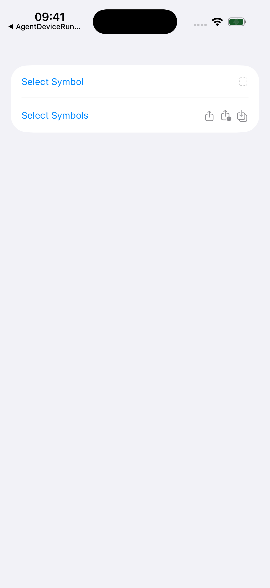
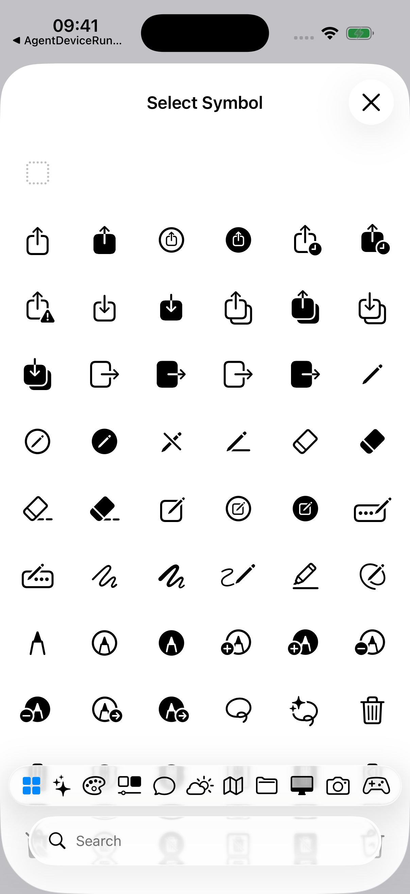
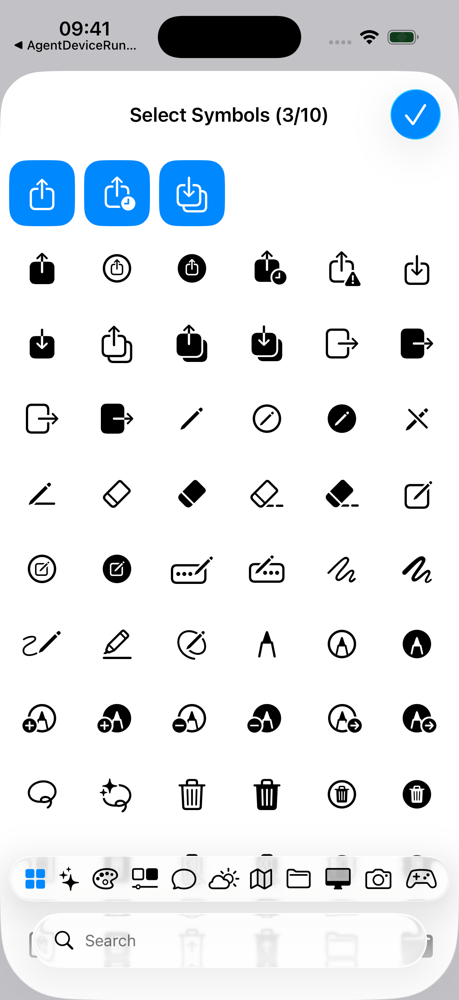

# SymbolPicker

A SwiftUI component for browsing and selecting SF Symbols. Supports single and multi-symbol selection, category browsing, and search. Requires iOS 17+ or macOS 14+.

## Installation

Add the package via Swift Package Manager using the repository URL.

## Usage

### SymbolPicker

`SymbolPicker` is a form-ready button row that presents the picker in a sheet when tapped. Use the `String?` initializer for single selection and the `[String]` initializer to allow multiple symbols.

```swift
// Single selection
@State private var icon: String?

SymbolPicker("Select Symbol", selection: $icon)

// Multiple selection
@State private var icons: [String] = []

SymbolPicker("Select Symbols", selection: $icons)
```



### SymbolPickerScreen

`SymbolPickerScreen` is the full picker screen for use in custom presentations. The `onDone` closure is called when the user confirms the selection; when omitted, the screen dismisses itself.

```swift
// Single selection
@State private var icon: String?
@State private var isPresented = false

.sheet(isPresented: $isPresented) {
    SymbolPickerScreen(symbol: $icon, onDone: { isPresented = false })
}

// Multiple selection
@State private var icons: [String] = []
@State private var isPresented = false

.sheet(isPresented: $isPresented) {
    SymbolPickerScreen(symbols: $icons)
}
```

| Single selection | Multiple selection |
|---|---|
|  |  |

## Configuration

All configuration is applied via view modifiers and propagates through the environment.

### Selection limit

Sets the maximum number of symbols a user can select. Defaults to 5. Pass `nil` to remove the limit. Has no effect in single-selection mode.

```swift
SymbolPickerScreen(symbols: $icons)
    .symbolPickerLimit(3)
```

### Ignored categories

Hides specific symbol categories from the category bar. By default, `whatsnew`, `multicolor`, and `variablecolor` are hidden.

```swift
SymbolPickerScreen(symbols: $icons)
    .ignoredSymbolCategories(["accessibility", "whatsnew"])
```

### Custom title

Replaces the navigation title with a custom `Text` view.

```swift
SymbolPickerScreen(symbols: $icons)
    .symbolPickerTitle(Text("Choose an icon").bold())
```
